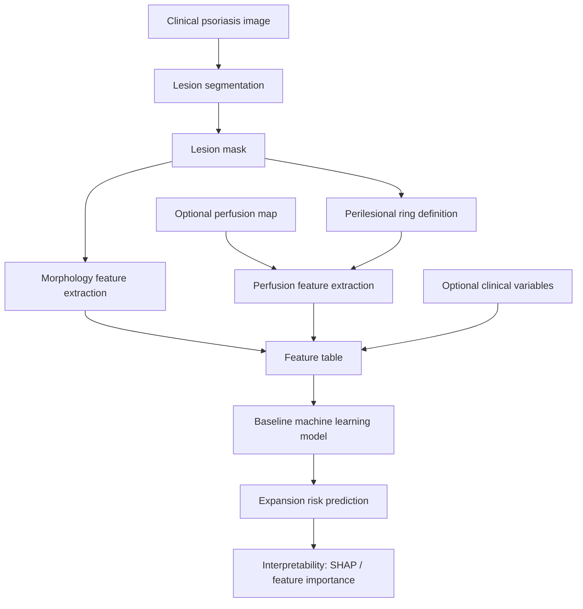
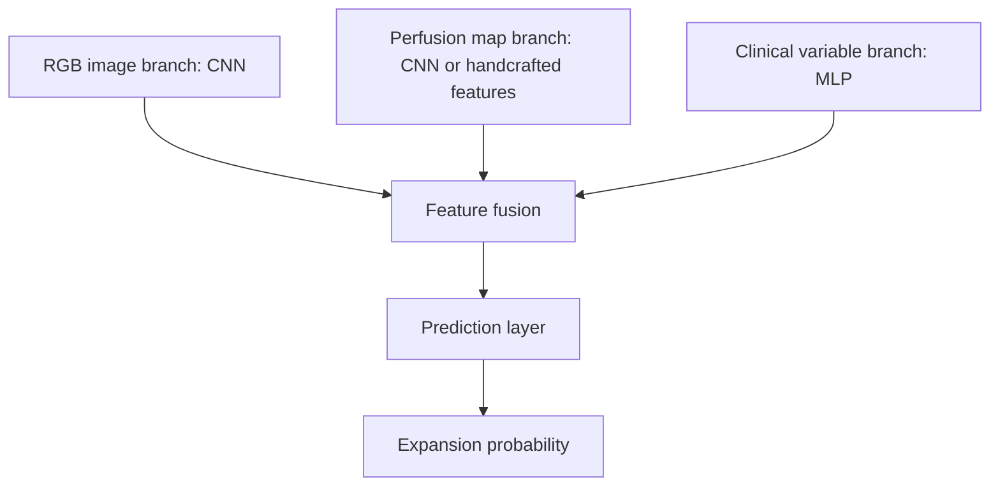

# 基于医学图像与微血管灌注信息的银屑病皮损扩展预测研究

> Working title: **Prediction of Psoriatic Lesion Expansion Using Medical Imaging, Perilesional Perfusion Features, and Machine Learning**

本文档把现阶段最需要完成的材料整理成一个可讨论版本：英文 short proposal、文献矩阵、research gap、数据路线、特征设计、preliminary pipeline、实验方案、meeting outline 和 PPT 提纲。当前定位是 **research proposal + preliminary pipeline design**，不是已经完成临床实验的论文。

---

## 1. Short Proposal for Dr Wang

### Title

**Machine Learning-Based Prediction of Psoriatic Lesion Expansion Using Medical Imaging and Perilesional Perfusion Features**

### Background

Psoriasis is a chronic inflammatory skin disease characterized by erythematous, scaly plaques. In clinical practice, psoriasis severity is commonly assessed using patient-level or body-region-level scores such as PASI, BSA, and DLQI. These scores are useful for evaluating current disease burden, but they provide limited information about whether an individual lesion will continue to enlarge, how fast it may expand, or which perilesional region is at higher risk of becoming involved.

Recent imaging research suggests that the skin surrounding visible psoriatic plaques may already show physiological abnormalities before visible lesion expansion occurs. In particular, Schaap et al. reported that perfusion measured by laser speckle contrast imaging (LSCI) may help predict expansion of psoriasis lesions. This finding supports the hypothesis that psoriatic lesion expansion is not entirely random, but may be associated with local microvascular activity, inflammation, tissue perfusion, and spatial boundary evolution.

At the same time, artificial intelligence and machine learning have increasingly been applied to psoriasis diagnosis, severity grading, PASI/BSA estimation, and treatment response prediction. However, most existing studies focus on current severity assessment rather than future local lesion progression. This leaves an important research gap: **can lesion-level imaging and perilesional physiological features be used to predict future psoriatic lesion expansion?**

### Research Gap

Existing studies have shown that:

1. Psoriatic lesions are associated with vascular, microvascular, and angiogenic changes.
2. Perilesional perfusion may contain early signals related to future lesion expansion.
3. Machine learning has been used in psoriasis assessment, especially for diagnosis and severity estimation.

However, the following problem remains underdeveloped:

> **A lesion-level prediction framework that combines current lesion morphology, perilesional perfusion, and machine learning to predict whether a psoriatic plaque will expand in the future.**

This gap is clinically meaningful because early identification of high-risk lesions may support closer monitoring, earlier local intervention, and more individualized disease management.

### Research Questions

The project will be organized around three levels of prediction.

**Primary task**

Can current lesion images and extracted features predict whether a psoriatic lesion will expand within a future time window?

```text
Input: current lesion image, lesion mask, morphology features, optional perfusion features
Output: expansion = 0 or 1
```

**Secondary task**

Can the model predict the future area growth rate of a lesion?

```text
growth rate = (area_t1 - area_t0) / area_t0
```

**Future task**

Can a model predict the future lesion boundary or expansion risk map?

```text
Input: current RGB image + lesion mask + perfusion map
Output: future lesion mask or expansion heatmap
```

At the current stage, the most realistic primary task is binary expansion prediction. Future mask prediction should be treated as future work because it requires longitudinal, lesion-level data.

### Data Plan

The full research would ideally require a longitudinal dataset containing the same lesion from the same patient across multiple time points. The minimum ideal data structure is:

| Data item | Role |
|---|---|
| t0 clinical RGB image | baseline visible lesion state |
| t0 lesion mask | baseline area and boundary |
| t0 perfusion map, such as LSCI or LDPI | local microvascular state |
| t1 clinical RGB image | follow-up lesion state |
| t1 lesion mask | future area and boundary |
| PASI/BSA | disease severity covariates |
| treatment status | confounding control |
| patient metadata | demographic and clinical covariates |

Since real longitudinal clinical data are not yet available, the preliminary work should use public psoriasis images to build the image-processing and feature-extraction pipeline. Public data cannot prove that perfusion predicts expansion, but it can demonstrate the feasibility of lesion segmentation, feature extraction, and baseline model construction.

### Method

The proposed framework is:

```text
Clinical image
-> Lesion segmentation
-> Lesion morphology feature extraction
-> Perilesional region definition
-> Perfusion / flow-inspired feature extraction
-> Machine learning model
-> Expansion risk prediction
```

The first version should use feature-based machine learning models such as logistic regression, random forest, XGBoost, LightGBM, and SVM. These models are more suitable than deep learning for early-stage small-sample studies and are easier to explain to medical collaborators.

If sufficient data become available later, the project can be extended to multimodal deep learning:

```text
RGB image branch + perfusion image branch + clinical variable branch
-> feature fusion
-> expansion prediction
```

### Expected Contribution

This project aims to shift psoriasis image analysis from static severity assessment to future local progression prediction. Its expected contributions are:

1. Define psoriatic lesion expansion as a lesion-level machine learning task.
2. Propose a feature framework combining morphology, perilesional perfusion, and flow-inspired variables.
3. Build a preliminary pipeline for segmentation, feature extraction, and baseline prediction.
4. Provide a clinically interpretable research direction for future longitudinal data collection.

### Current Stage and Request for Feedback

At this stage, I am not claiming that the model can already make clinically valid predictions. Instead, I would like to discuss whether this direction is scientifically meaningful and how to design a feasible preliminary study.

The questions I hope to discuss are:

1. Is lesion-level expansion prediction a meaningful psoriasis research question?
2. Is it reasonable to begin with public image data for segmentation and feature extraction?
3. What would be the minimum clinical dataset needed for a pilot study?
4. Would perfusion imaging, such as LSCI or LDPI, be feasible in a future collaboration?

---

## 2. 中文研究计划摘要

银屑病是一种慢性炎症性皮肤病，典型表现为边界较清楚的红斑、鳞屑和斑块。现有银屑病人工智能研究多集中于诊断分类、严重程度评估、PASI/BSA 预测和治疗反应预测，而对于单个皮损未来是否扩展、扩展程度如何以及扩展区域在哪里，相关研究仍较少。

已有研究提示，银屑病皮损周围区域的微血管灌注变化可能早于肉眼可见的皮损扩大出现。因此，皮损扩展可能不是完全随机发生，而是与局部微循环、炎症传播、组织灌注和皮损边界时空演化有关。本文拟从医学图像、微血管灌注和机器学习交叉的角度，提出一个银屑病皮损扩展预测的初步框架。

本研究的核心问题是：给定当前皮损图像、皮损边界、形态特征以及可能获得的微血管灌注信息，能否预测未来一段时间内该皮损是否会扩大？在现阶段，最现实的任务是建立 binary classification 框架，即预测皮损未来是否扩展。进一步可以预测面积增长率，最终扩展到未来皮损 mask 或扩展风险热力图预测。

由于目前尚未获得真实临床纵向数据，研究应先以公开银屑病图像数据为基础，完成 lesion segmentation、morphology feature extraction 和 baseline machine learning pipeline。该 preliminary work 不能证明灌注与扩展之间的医学关系，但可以证明方法框架可行，为后续寻求导师指导、医学合作和临床数据支持做准备。

---

## 3. Research Gap Summary

### 已有研究证明什么

1. 银屑病皮损与局部炎症、血管生成、微血管异常和灌注变化有关。
2. LSCI 等技术可以量化皮肤局部灌注，已有研究直接提示 perilesional perfusion 对银屑病皮损扩展有预测价值。
3. 机器学习已经被用于银屑病诊断、严重程度评估、PASI/BSA 估计、治疗选择和远程监测。
4. 在伤口、肿瘤和其他病灶研究中，已有许多使用图像分割、纵向影像和机器学习预测病灶变化的方法。

### 还没有很好解决什么

1. 银屑病研究中缺少成熟的 lesion-level future expansion prediction 框架。
2. 现有 AI 研究多数预测当前严重程度，而不是预测单个皮损未来变化。
3. 微血管灌注特征尚未被系统整合进机器学习扩展预测模型。
4. 物理流动、扩散、边界演化等思想尚未与银屑病影像预测充分结合。
5. 缺少公开可用的“同一患者、同一皮损、多时间点、含灌注图”的数据集。

### 我的研究可以补什么空白

本研究可以把银屑病 AI 任务从 “current severity assessment” 推进到 “future local lesion progression prediction”。即使在没有真实临床纵向数据的早期阶段，也可以先建立可复用的 pipeline：图像分割、形态特征提取、perilesional region 定义、灌注/flow-inspired 特征设计和 baseline ML 预测框架。

---

## 4. Literature Review Matrix

> 注：下表将文献分为“核心医学依据”“AI 研究现状”“方法参考”和“公开数据/工具参考”。2026 年文献是根据截至 2026-06-30 的 PubMed 记录整理，后续正式论文写作前应再核对一次。

| 论文/资源 | 数据/对象 | 预测目标或研究目标 | 方法 | 主要结果/价值 | 和本题目的关系 |
|---|---|---|---|---|---|
| Schaap et al., 2022, *Skin Research and Technology*: “Perfusion measured by laser speckle contrast imaging as a predictor for expansion of psoriasis lesions” | 银屑病皮损，LSCI 灌注成像 | 研究灌注是否可预测皮损扩展 | LSCI/perfusion features | perilesional perfusion 与 lesion expansion 相关 | 本题目的核心医学依据 |
| Knudsen et al., 2026, *Skin Health and Disease*: “Microvascular alterations in nonlesional psoriatic skin versus healthy control skin...” | 非皮损银屑病皮肤与健康皮肤 | 观察非皮损区域微血管改变 | OCT angiography | 非皮损皮肤也可能存在微血管异常 | 支持“可见边界外已有异常信号”的医学背景 |
| Luengas-Martinez et al., 2023, *Skin Health and Disease*: “Inhibition of VEGF-A downregulates angiogenesis in psoriasis” | 银屑病与 VEGF-A/血管生成 | 研究 VEGF-A 与血管生成 | pilot study | 说明血管生成与银屑病活动相关 | 支持血管/灌注特征的生物学合理性 |
| Zheng et al., 2026, *Journal of Research in Medical Sciences*: “Linear psoriasis and Koebner phenomenon: A review” | Koebner phenomenon 文献 | 总结外伤/刺激诱发银屑病皮损 | review | 局部刺激可诱发新皮损或线状分布 | 支持局部皮肤环境与新发/扩展相关 |
| Gong et al., 2025, *Frontiers in Digital Health*: “Digital technologies in psoriasis management...” | 银屑病数字医疗研究 | 总结数字技术在银屑病管理中的应用 | review | AI/数字技术可用于诊断、监测和治疗管理 | 说明银屑病数字化管理已有基础 |
| Chou et al., 2025/2026, *Dermatology*: “Using Artificial Intelligence to Automate the Analysis of Psoriasis Severity” | 银屑病图像 | 自动分析银屑病严重程度 | AI image analysis | 聚焦 severity assessment | 说明现有 AI 多预测当前严重程度 |
| Oliver et al., 2026, *JAAD*: “AI-Powered Imaging for Objective Psoriasis Severity Assessment at Home” | 家庭场景银屑病图像 | 客观严重程度评估 | AI imaging, RCT feasibility | 家庭图像评估可行 | 说明 psoriasis AI 正在向远程监测发展，但仍不是局部扩展预测 |
| Niri et al., 2025, *Journal of Imaging Informatics in Medicine*: “Wound Segmentation with U-Net...” | 伤口图像 | 伤口分割 | U-Net, attention, transfer learning | 分割可用于计算面积和形态 | 方法参考：皮损 segmentation 和面积提取 |
| Spinazzola et al., 2025, *Journal of Clinical Medicine*: “Chronic Ulcers Healing Prediction through Machine Learning...” | 糖尿病足慢性溃疡 | 愈合预测 | machine learning | 使用临床/图像相关变量预测变化 | 方法参考：纵向病灶变化预测 |
| Ronneberger et al., 2015, U-Net | 生物医学图像 | segmentation | encoder-decoder CNN | 医学图像分割经典框架 | 后续 lesion mask 自动生成的基础模型 |
| Kirillov et al., 2023, Segment Anything | 通用图像分割 | promptable segmentation | foundation model | 可辅助人工标注 | 前期可用于半自动皮损标注 |
| Fitzpatrick17k / SCIN / DermNet / Roboflow psoriasis segmentation | 公开皮肤病图像 | 分类、分割、pipeline demo | public datasets | 可用于 preliminary pipeline | 不能做真实扩展预测，但可用于方法原型 |

### 推荐先读的 10 篇/类

1. Schaap et al., 2022: LSCI 灌注预测银屑病皮损扩展。
2. Knudsen et al., 2026: 非皮损银屑病皮肤微血管改变。
3. Luengas-Martinez et al., 2023: VEGF-A 与银屑病血管生成。
4. Zheng et al., 2026: Koebner phenomenon review。
5. Gong et al., 2025: 银屑病数字技术综述。
6. Chou et al., 2025/2026: AI 自动分析银屑病严重程度。
7. Oliver et al., 2026: 家庭场景 AI 银屑病严重程度评估。
8. Niri et al., 2025: U-Net 伤口分割。
9. Spinazzola et al., 2025: 慢性溃疡愈合预测。
10. U-Net / Segment Anything / Fitzpatrick17k / SCIN：方法和公开数据工具。

---

## 5. Research Question Definition

### Primary Task: 是否扩展预测

**Research question**

给定当前皮损图像、皮损 mask、形态特征和可选灌注特征，能否预测未来一定时间内该皮损是否会扩大？

**Machine learning form**

```text
Input:
  RGB image_t0
  lesion mask_t0
  morphology features_t0
  optional perfusion features_t0
  optional clinical covariates_t0

Output:
  expansion label at t1
  0 = stable or decreased
  1 = expanded
```

**Label definition**

```text
growth_rate = (area_t1 - area_t0) / area_t0

if growth_rate > 10%:
    expansion = 1
else:
    expansion = 0
```

10% 是初始建议阈值，后续应根据皮肤科老师意见、测量误差和标注一致性调整。

### Secondary Task: 扩展多少

**Research question**

能否预测未来皮损面积增加多少？

**Machine learning form**

```text
Input: current lesion state
Output: growth_rate
```

这是 regression task。

### Future Task: 往哪里扩展

**Research question**

能否预测未来皮损边界或扩展风险区域？

**Machine learning form**

```text
Input:
  RGB image_t0
  lesion mask_t0
  perfusion map_t0

Output:
  lesion mask_t1
  or expansion heatmap
```

这是 image-to-image prediction / future segmentation task。现阶段只作为 future work。

---

## 6. Data Feasibility Table

| 数据来源 | 能做什么 | 不能做什么 | 用在本研究哪一步 |
|---|---|---|---|
| 公开 psoriasis clinical images, 如 DermNet、Fitzpatrick17k、SCIN、Kaggle | 分类、图像预处理、分割 demo、形态特征提取 | 无法证明真实扩展预测，因为通常无同一皮损随访 | Phase 1 preliminary image pipeline |
| 公开 psoriasis segmentation 数据，如 Roboflow 或其他标注数据 | 训练/测试 lesion segmentation | 数据质量、标注标准、授权需核对 | segmentation baseline |
| 公开 perfusion 或 vascular imaging 数据 | 学习灌注图处理、特征计算方法 | 通常不是银屑病，也不一定有 lesion expansion 标签 | perfusion feature engineering demo |
| 模拟扩展数据 | 测试模型逻辑、检查 pipeline 能否跑通 | 不能作为医学结论，不能证明 perfusion causality | proof-of-concept |
| 小规模真实 longitudinal clinical data | 真实扩展预测、模型验证 | 获取困难，需要伦理、同意、标注和临床支持 | pilot study |
| LSCI/LDPI + RGB + longitudinal mask | 最理想的真实研究数据 | 设备和合作成本高 | final multimodal study |

### 最小真实数据方案

如果后续老师愿意合作，可设计小规模 pilot：

```text
10-20 名患者
每名患者 2-5 个斑块型银屑病皮损
每个皮损 2-3 个时间点
时间间隔：1-2 周
```

最小数据包括：

```text
RGB clinical image_t0
lesion mask_t0
RGB clinical image_t1
lesion mask_t1
treatment status
PASI/BSA if available
```

增强数据包括：

```text
LSCI or LDPI perfusion map_t0
LSCI or LDPI perfusion map_t1
body site
symptom duration
current medication
```

---

## 7. Feature Design Document

### 7.1 Morphology Features

从 lesion mask 中提取：

| Feature | Definition | Why it matters |
|---|---|---|
| area | lesion pixel area, converted to physical area if scale is known | 当前皮损大小 |
| perimeter | boundary length | 边界复杂程度 |
| circularity | `4*pi*area / perimeter^2` | 越低说明形状越不规则 |
| compactness | area relative to convex hull or bounding box | 描述皮损紧凑程度 |
| edge irregularity | normalized boundary fluctuation | 边界不稳定可能与扩展相关 |
| aspect ratio | width / height | 描述形态方向性 |
| solidity | area / convex hull area | 描述凹凸性 |
| fractal-like boundary complexity | multi-scale boundary roughness | 用于探索复杂边界是否更易扩展 |

### 7.2 Perilesional Region Definition

核心思想：定义皮损边界外的一圈或多圈区域。

```text
lesion mask = M
outer ring 1 = dilation(M, r1) - M
outer ring 2 = dilation(M, r2) - dilation(M, r1)
```

如果有真实物理尺度：

```text
ring 1: 0-5 mm outside lesion boundary
ring 2: 5-10 mm outside lesion boundary
```

如果只有普通图片：

```text
ring 1: 5-15 pixels outside boundary
ring 2: 15-30 pixels outside boundary
```

后续需要根据图像分辨率和拍摄距离校准。

### 7.3 Perfusion Features

如果有 LSCI 或 LDPI perfusion map，可以提取：

| Feature | Definition | Hypothesis |
|---|---|---|
| mean perfusion inside lesion | lesion mask 内平均灌注 | 当前炎症/血流活动 |
| mean boundary perfusion | 边界附近平均灌注 | 边界活动性 |
| mean perilesional perfusion | lesion 外环平均灌注 | 潜在早期扩展信号 |
| maximum perilesional perfusion | 外环最大灌注 | 局部高风险点 |
| perfusion SD | 灌注标准差 | 灌注不均匀性 |
| high-perfusion ratio | 外环中高于阈值的像素比例 | 高灌注区域占比 |
| perfusion gradient | 从皮损中心到周围的灌注变化 | flow/diffusion 启发变量 |
| directional perfusion asymmetry | 不同方向外环灌注差异 | 预测扩展方向 |

### 7.4 Flow-Inspired Features

这些变量不是直接证明银屑病等于物理扩散，而是借用 flow / transport / diffusion 的思想增强解释性。

| Feature | Design | Meaning |
|---|---|---|
| radial perfusion gradient | 沿边界法向从内到外计算灌注变化 | 灌注从皮损向周围传播的模式 |
| boundary normal risk | 每个边界点外法向方向的高灌注程度 | 哪个方向可能扩展 |
| local heterogeneity index | 外环局部灌注方差 | 组织环境是否不均一 |
| diffusion-like risk field | 以边界和灌注为源构造风险热力图 | 可视化潜在扩展区域 |
| boundary velocity, if longitudinal | `distance(boundary_t1, boundary_t0) / time` | 真实边界移动速度 |

---

## 8. Preliminary Pipeline

### Phase 1: 文献理解

产出：

```text
Literature Review Matrix
Research Gap Summary
10 core references
```

目标：

1. 说明为什么这个问题有研究价值。
2. 说明别人主要做 severity，不是 lesion-level expansion。
3. 找到 perfusion 与 lesion expansion 的核心依据。

### Phase 2: 公开图像数据准备

数据候选：

```text
DermNet psoriasis images
Fitzpatrick17k
SCIN
Roboflow psoriasis segmentation
Kaggle skin disease datasets
```

需要检查：

```text
license
image quality
psoriasis label reliability
mask availability
body site metadata
skin tone diversity
```

### Phase 3: Lesion Segmentation Demo

第一版：

```text
manual annotation of 20-50 images
SAM-assisted mask generation
basic threshold refinement
```

第二版：

```text
U-Net or lightweight segmentation model
```

评价：

```text
Dice score
IoU
boundary error
```

### Phase 4: Morphology Feature Extraction

输入：

```text
lesion mask
```

输出：

```text
image_id
area
perimeter
circularity
compactness
edge_irregularity
aspect_ratio
solidity
```

### Phase 5: Simulated Expansion Label

由于公开数据通常没有真实 t1，前期可用模拟标签测试模型结构。

示例方案：

```text
simulated_risk_score =
    0.35 * normalized_edge_irregularity
  + 0.25 * normalized_area
  + 0.25 * simulated_perilesional_perfusion
  + 0.15 * random_noise

expansion_label = 1 if simulated_risk_score > threshold else 0
```

重要声明：

> simulated expansion label 只能用于 proof-of-concept，不能作为医学结论。

### Phase 6: Baseline Model

分类模型：

```text
Logistic Regression
Random Forest
XGBoost
LightGBM
SVM
```

回归模型：

```text
Linear Regression
Random Forest Regressor
XGBoost Regressor
```

解释性：

```text
feature importance
SHAP
partial dependence plot
```

---

## 9. Experimental Design

### Experiment 1: Morphology Only

目的：测试皮损当前形态是否提供扩展风险信号。

输入：

```text
area
perimeter
circularity
edge_irregularity
aspect_ratio
compactness
```

输出：

```text
future expansion label
```

### Experiment 2: Perfusion Only

目的：测试 perilesional perfusion 是否具有独立预测价值。

输入：

```text
mean_perilesional_perfusion
max_perilesional_perfusion
perfusion_SD
perfusion_gradient
high_perfusion_ratio
```

输出：

```text
future expansion label
```

### Experiment 3: Morphology + Perfusion

目的：测试多源特征是否优于单一特征。

输入：

```text
morphology features
perfusion features
```

输出：

```text
expansion probability
```

### Experiment 4: Add Clinical Variables

目的：控制患者差异和治疗影响。

输入：

```text
morphology
perfusion
age
sex
body site
disease duration
PASI/BSA
treatment status
```

输出：

```text
expansion risk
```

### Experiment 5: Future Mask Prediction

现阶段只作为 future work。

输入：

```text
RGB image_t0
mask_t0
perfusion map_t0
```

输出：

```text
mask_t1
or expansion heatmap
```

模型：

```text
U-Net-based prediction
ConvLSTM
Temporal CNN
Transformer-based model
physics-informed / reaction-diffusion inspired model
```

---

## 10. Evaluation Metrics

### Classification

```text
Accuracy
Precision
Recall
F1-score
AUC-ROC
Sensitivity
Specificity
Calibration curve
```

临床上应特别关注 sensitivity，因为漏掉真正会扩展的高风险皮损可能比误报更严重。

### Regression

```text
MAE
RMSE
R^2
Pearson correlation
Spearman correlation
```

### Segmentation / Future Mask

```text
Dice score
IoU
Hausdorff distance
boundary displacement error
predicted expansion area overlap
```

### Interpretability

```text
SHAP
feature importance
Grad-CAM
attention map
partial dependence plot
```

重点解释：

1. perilesional perfusion 是否是重要变量；
2. 灌注梯度是否影响扩展风险；
3. 哪些边界区域更可能成为未来扩展区域；
4. 加入 flow-inspired features 是否提升解释性。

---

## 11. Flowchart and Model Diagrams

### Overall Pipeline



### Data Roadmap


### Multimodal Model Idea



---

## 12. Meeting Outline for Dr Wang

### 30-second opening

我想做的方向是：用医学图像和皮损周围微血管灌注信息，预测斑块型银屑病单个皮损未来是否会扩展。现有 AI 研究多关注当前严重程度评估，但我想把任务收窄到 lesion-level future progression prediction。因为我目前没有临床纵向数据，所以想先做一个公开图像数据上的 segmentation 和 feature extraction pipeline，再请您判断这个研究问题是否值得继续推进，以及未来真实数据该如何设计。

### 我为什么做这个题

1. 银屑病临床评估通常关注当前严重程度，但单个皮损未来会不会扩大也有临床意义。
2. 已有 LSCI 研究提示 perilesional perfusion 可能预测 lesion expansion。
3. 这个问题可以连接医学图像、微血管灌注、机器学习和 flow/diffusion-inspired modeling。

### 我想预测什么

Primary task：

```text
Predict whether a psoriatic plaque will expand within a future time window.
```

Secondary task：

```text
Predict future area growth rate.
```

Future task：

```text
Predict future lesion boundary or expansion heatmap.
```

### 我担心的数据问题

1. 真正需要同一患者、同一皮损、多时间点数据。
2. 如果没有 t1，就不能严格做真实扩展预测。
3. LSCI/LDPI 灌注图可能很难获得。
4. 治疗状态、拍摄条件和标注质量都会影响模型。

### 我想先用公开数据做什么

1. 找公开 psoriasis images。
2. 做 lesion segmentation demo。
3. 提取 area、perimeter、circularity、edge irregularity 等特征。
4. 定义 perilesional ring。
5. 设计 perfusion/flow-inspired feature list。
6. 用 simulated label 跑通 baseline model。

### 我希望老师帮我判断什么

1. 这个题目是否有研究价值？
2. primary task 是否应该先做“是否扩展”？
3. 公开数据 preliminary work 是否合理？
4. 如果要做 pilot clinical study，最小数据量和随访时间应该怎么设？
5. 是否有可能接触到皮肤科老师、医学影像资源或灌注成像数据？

### 会后记录模板

```text
Dr Wang's feedback:
1.
2.
3.

Agreed next steps:
1.
2.
3.

Questions to solve:
1.
2.
3.
```

---

## 13. Five-Slide PPT Outline

### Slide 1: Research Problem

Title:

```text
Prediction of Psoriatic Lesion Expansion Using Medical Imaging and Perilesional Perfusion Features
```

Key points:

```text
Psoriasis severity scores describe current disease burden.
They do not directly predict whether a specific lesion will expand.
Lesion-level future progression prediction remains underdeveloped.
```

### Slide 2: Research Gap

Visual:

```text
Existing AI psoriasis studies:
diagnosis -> severity assessment -> treatment response

Proposed direction:
current lesion state -> future lesion expansion risk
```

Key message:

```text
From current severity assessment to future local lesion progression prediction.
```

### Slide 3: Proposed Pipeline

Use the overall pipeline diagram:

```text
Clinical image
-> Lesion segmentation
-> Morphology features
-> Perilesional ring
-> Perfusion / flow features
-> ML model
-> Expansion risk
```

### Slide 4: Data Plan

Table:

```text
Public images: segmentation + feature extraction
Simulated data: proof-of-concept model
Clinical longitudinal data: real expansion prediction
Perfusion data: multimodal future study
```

Key warning:

```text
Public static images cannot prove real expansion prediction.
```

### Slide 5: Questions for Discussion

Questions:

```text
Is lesion-level expansion prediction meaningful?
Is the preliminary public-data pipeline reasonable?
What is the minimum clinical dataset for a pilot study?
Could perfusion imaging be feasible in future collaboration?
```

---

## 14. Next Two-Week Action Plan

### Week 1

1. Read and annotate the 10 core references.
2. Make a cleaner literature matrix with BibTeX/DOI/PMID.
3. Select 1-2 public psoriasis image datasets.
4. Collect 30-50 sample images for segmentation testing.

### Week 2

1. Create 20-30 preliminary lesion masks manually or with SAM assistance.
2. Write a script to compute morphology features.
3. Build a feature table.
4. Create a simulated expansion label only for pipeline demonstration.
5. Train a simple logistic regression/random forest baseline.
6. Prepare the 5-slide discussion deck.

---

## 15. Key Limitations to State Clearly

1. Without longitudinal data, the project cannot make real claims about future expansion.
2. Simulated expansion labels are only for testing the computational pipeline.
3. Perfusion and expansion may be correlated, but causality cannot be claimed without stronger clinical design.
4. Treatment changes may strongly affect lesion evolution and must be recorded.
5. Image scale, lighting, body site, skin tone, and camera angle may influence feature extraction.
6. Small clinical datasets may not support complex deep learning models.
7. Segmentation quality directly affects all downstream features.
8. Medical supervision and ethics approval are required for real patient data.

---

## 16. References and Links

Core PubMed/PMC references:

1. Schaap MJ et al. “Perfusion measured by laser speckle contrast imaging as a predictor for expansion of psoriasis lesions.” *Skin Research and Technology*, 2022. PMID: 34619003. DOI: 10.1111/srt.13098. https://pubmed.ncbi.nlm.nih.gov/34619003/
2. Knudsen NM et al. “Microvascular alterations in nonlesional psoriatic skin versus healthy control skin...” *Skin Health and Disease*, 2026. PMID: 41646542. DOI: 10.1093/skinhd/vzaf083. https://pubmed.ncbi.nlm.nih.gov/41646542/
3. Luengas-Martinez A et al. “Inhibition of vascular endothelial growth factor-A downregulates angiogenesis in psoriasis: A pilot study.” *Skin Health and Disease*, 2023. PMID: 37799359. DOI: 10.1002/ski2.245. https://pubmed.ncbi.nlm.nih.gov/37799359/
4. Zheng L et al. “Linear psoriasis and Koebner phenomenon: A review.” *Journal of Research in Medical Sciences*, 2026. PMID: 41852788. DOI: 10.4103/jrms.jrms_364_25. https://pubmed.ncbi.nlm.nih.gov/41852788/
5. Gong Z et al. “Digital technologies in psoriasis management: from precision diagnosis to therapeutic innovation and holistic care.” *Frontiers in Digital Health*, 2025. PMID: 41293553. DOI: 10.3389/fdgth.2025.1656585. https://pubmed.ncbi.nlm.nih.gov/41293553/
6. Chou CL et al. “Using Artificial Intelligence to Automate the Analysis of Psoriasis Severity: A Pilot Study.” *Dermatology*, 2025/2026. PMID: 41269911. DOI: 10.1159/000549640. https://pubmed.ncbi.nlm.nih.gov/41269911/
7. Oliver M et al. “AI-Powered Imaging for Objective Psoriasis Severity Assessment at Home: Feasibility and Reliability in a Randomized Clinical Trial.” *Journal of the American Academy of Dermatology*, 2026. PMID: 42288213. DOI: 10.1016/j.jaad.2026.06.047. https://pubmed.ncbi.nlm.nih.gov/42288213/
8. Niri R et al. “Wound Segmentation with U-Net Using a Dual Attention Mechanism and Transfer Learning.” *Journal of Imaging Informatics in Medicine*, 2025. PMID: 39849203. DOI: 10.1007/s10278-025-01386-w. https://pubmed.ncbi.nlm.nih.gov/39849203/
9. Spinazzola E et al. “Chronic Ulcers Healing Prediction through Machine Learning Approaches: Preliminary Results on Diabetic Foot Ulcers Case Study.” *Journal of Clinical Medicine*, 2025. PMID: 40363975. DOI: 10.3390/jcm14092943. https://pubmed.ncbi.nlm.nih.gov/40363975/
10. Ronneberger O et al. “U-Net: Convolutional Networks for Biomedical Image Segmentation.” MICCAI, 2015. https://arxiv.org/abs/1505.04597
11. Kirillov A et al. “Segment Anything.” 2023. https://arxiv.org/abs/2304.02643

Dataset/tool references to verify before use:

1. Fitzpatrick17k dataset: https://github.com/mattgroh/fitzpatrick17k
2. SCIN dataset: https://research.google/blog/scin-a-new-resource-for-representative-dermatology-images/
3. DermNet NZ image library: https://dermnetnz.org/images
4. Roboflow public datasets: https://universe.roboflow.com/

